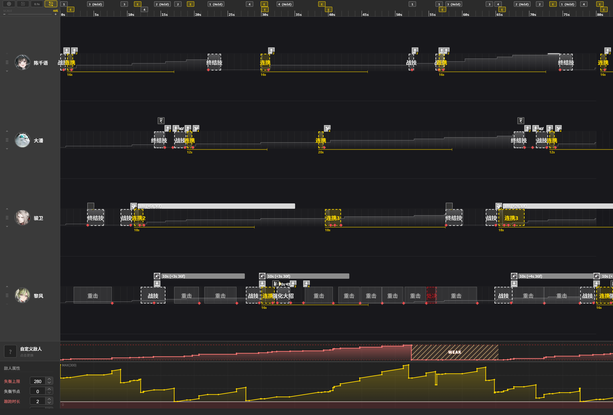

# Endfield Timeline Editor - 《明日方舟：终末地》排轴工具

**Endaxis** 是一个基于 Web 专为《明日方舟：终末地》设计的可视化时间轴编辑工具。

> ⚠️ **注意**：本项目是一个粉丝自制工具，目前处于开发阶段。

## 🌐 在线体验

**项目已部署，点击下方链接即可直接使用：**

👉 **[http://lieyuan.top/Endaxis/](http://lieyuan.top/Endaxis/)**

## 目前所能实现的效果



## ✨ 核心功能 

* **🎯 高精度排轴**：基于 CSS Grid 的时间网格，支持精确到 `0.1s` 的动作块拖拽与对齐。
* **🔄 拖放交互**：使用 `Vue.Draggable` 实现流畅的技能拖放体验，支持从技能库拖入轨道及轨道内调整。
* **🔗 连携可视化**：通过 SVG 动态绘制贝塞尔曲线，实时显示技能之间的连携与依赖关系。
* **👥 多角色管理**：支持动态切换轨道干员，严格的放置判定逻辑确保操作准确性。
* **🛠️ 内置数据编辑器**：提供可视化的 JSON 数据编辑器，方便维护干员属性与技能数据。

## 🛠️ 技术栈

本项目使用现代前端技术栈构建：

* **框架**: [Vue 3](https://vuejs.org/) (Composition API)
* **构建工具**: [Vite](https://vitejs.dev/)
* **状态管理**: [Pinia](https://pinia.vuejs.org/)
* **UI 组件库**: [Element Plus](https://element-plus.org/)
* **拖拽库**: [Vue.Draggable](https://github.com/SortableJS/vue.draggable.next)
* **样式**: CSS Grid + CSS Variables

## 🔧 开发者工具

项目内置了一个隐藏的数据编辑器，用于生成 `gamedata.json` 文件。

**访问地址：**
* **本地开发**：`http://localhost:5173/Endaxis/editor`

**使用说明：**
1. 访问上述页面。
2. 在此页面可以添加新干员、修改技能属性（CD、消耗、倍率等）。
3. 点击“生成并下载”按钮，将下载的文件覆盖项目中的 `public/gamedata.json` 即可更新数据。

## 🚀 本地开发

如果你想在本地运行或参与开发：

### 环境要求

* Node.js (推荐 v16+)
* npm 或 yarn

### 安装依赖

```bash
npm install
```

### 启动开发服务器

```bash
npm run dev
```

启动后访问 `http://localhost:5173/Endaxis` 即可看到排轴器界面。
